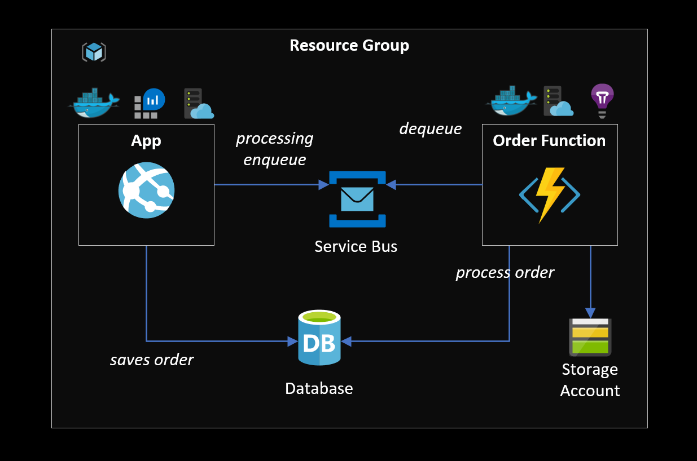

# Beer Shop

A demo project showcasing Terraform features with Azure cloud.

This demo is composed of three main modules:

- [**App**](/app) - A dotnet MVC site for user interaction where the user is able to push orders to a queue.
- [**Functions**](/functions) - The backend for the application that pulls and processes messages in the queue.
- [**Infrastructure**](/infrastructure) - The actual Terraform code that creates all the required resources.

## Demo architecture

The following diagram shows all the resources provisioned with Terraform, plus an ACR for Docker images.

 </img>

## Local Development

<u>Requirements</u>: Docker, Azure Functions Core Tools, Node, TypeScript, .NET Core 6.

### Database

Pull and start PostgreSQL

```sh
docker pull postgres
docker run --name some-postgres -e POSTGRES_PASSWORD="StrongPassword#999" -p 5432:5432 -d postgres
```

### App

Create `appsettings.Development.json` from the template and manually enter the Service Bus connection string.

Start the app

```sh
dotnet restore
dotnet run
```

Migrations will be applied at runtime.

### Functions

Create the `local.settings.json` from the template and manually enter the Service Bus connection string.

Start the function

```sh
yarn install
yarn start
```

Don't forget to run the dotnet app first for the required migrations.


#### Manual steps

Add Log Analytics to the App Service

## Terraform

The infrastructure also has three modules:

- **Enterprise (Terraform Cloud)** - Creates the workspaces ("pipelines") in Terraform Cloud
- **Main** - The resources of the solution
- **Shared** - Resources shared across main environments (dev, qa, prod, etc)

First `cd` into the `intfrastructure` directory:

```sh
cd infrastructure
```

Create the shared resources that can be used across multiple applications:

```sh
terraform -chdir=shared init
terraform -chdir=shared plan
terraform -chdir=shared apply -auto-approve
```

Create the app infrastructure:

```sh
# create the sample tfvars & add edit with the secret values
cp config/main-example.tfvars main/main.tfvars

# execute terraform
terraform -chdir=main init
terraform -chdir=main plan -var-file='main.tfvars'
terraform -chdir=main apply -var-file='main.tfvars' -auto-approve
```

## Extra

Also [Azure Functions Bindings](https://docs.microsoft.com/en-us/azure/azure-functions/functions-bindings-service-bus-trigger?tabs=csharp) proved very useful.
https://jhooq.com/terraform-variable-and-tfvars-file/