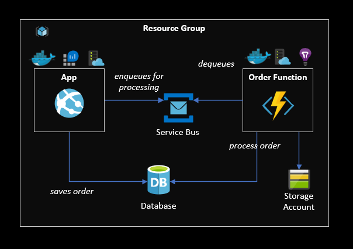

# Beer Shop

A demo project showcasing Terraform features on top of Azure.

This demo is composed of three main modules:

- [**App**](/app) - A dotnet MVC site for user interaction where the user is able to push orders to a queue.
- [**Functions**](/functions) - The backend for the application that pulls and processes messages in the queue.
- [**Infrastructure**](/infrastructure) - The actual Terraform code that creates all the required resources.

## Demo architecture

The following diagram shows all the resources provisioned with Terraform, plus an ACR for Docker images.

 </img>

## Local Development

<u>Requirements</u>: Docker, Azure Functions Core Tools, Node, TypeScript, Dotnet 3.1

### Database

Pull and start PostgreSQL

```sh
docker pull postgres
docker run --name some-postgres -e POSTGRES_PASSWORD="StrongPassword#999" -p 5432:5432 -d postgres
```

### App

Create `appsettings.Development.json` from the template and manually enter the Service Bus connection string.

Start the app

sh
```
dotnet restore
dotnet run
```

Migrations will be applied at runtime.

### Functions

Create the `local.settings.json` from the template and manually enter the Service Bus connection string.

Start the function

```sh
npm i
npm start
```

Don't forget to run the dotnet app first for the required migrations.

### Infrastructure

The infrastructure also has three modules:

- **Enterprise** - Creates the workspaces ("pipelines") in Terraform Cloud
- **Main** - The resources of the solution
- **Shared** - Resources shared accross main environments (dev, qa, prod, etc)

To quickly Use Terraform Cloud with [infrastructure/enterprise](infrastructure/enterprise) module as a workspace. It uses the Terraform Enteprise Provider to automatically build the workspaces.

You maybe also use the Terraform CLI or any other CI/CD tool.

#### Manual steps

1. Add Log Analytics to the App Service

### New Environments

If the shared environment is recreated add the new `ACR_ADMIN_PASSWORD` to the enterprise workspace.

1. Add the matching database password to the enteprise workspace
3. Add branch, worksking


## Extra

Checkout my [slide deck](https://slides.com/epomatti/terraform) about Terraform.

Also [Azure Functions Bindings](https://docs.microsoft.com/en-us/azure/azure-functions/functions-bindings-service-bus-trigger?tabs=csharp) proved very useful.